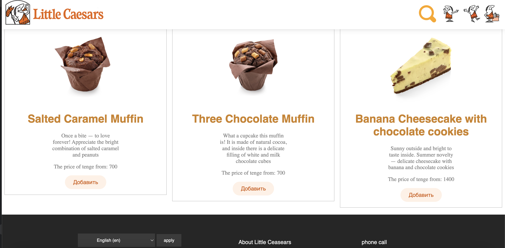
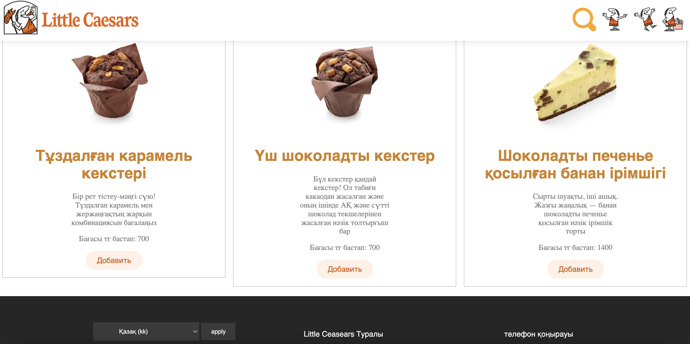
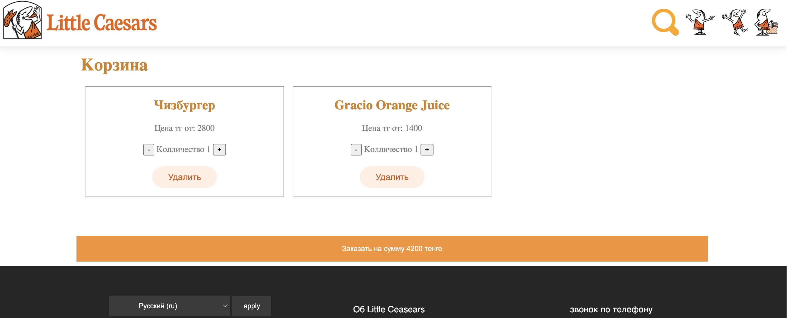
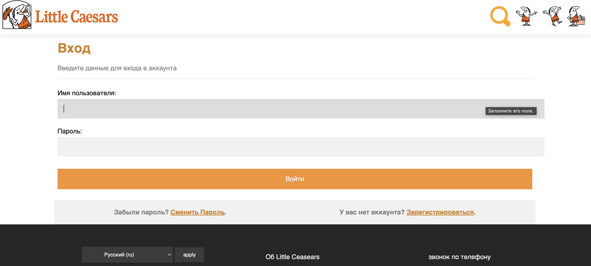

# 🍕 Little Caesars - Django Pizza Web App

Django
Python

Проект онлайн-пиццерии, вдохновленный брендом **Little Caesars**. Позволяет просматривать меню, добавлять товары в корзину и оформлять заказы с уведомлением по почте.

---

<table width="100%">
  <tr>
    <td width="33.3%"   align="center"></td>
    <td width="33.3%"  align="center"></td>
    <td width="33.3%"  align="center"></td>
  </tr>
  <tr>
    <td width="33.3%"   align="center"></td>
    <td width="33.3%"  align="center"></td>
    <td width="33.3%" align="center"></td>
  </tr>
</table>


## 🚀 Основной функционал

- **Каталог товаров:** Выбор пиццы, закусок и напитков.
- **Корзина:** Динамическое добавление и удаление товаров.
- **Оформление заказа:** Интеграция с SMTP Gmail для отправки подтверждений заказа.
- **Админ-панель:** Удобное управление контентом и пользователями.
- **Безопасность:** Использование переменных окружения (.env) для защиты данных.

---

## 🛠 Технологический стек

- **Backend:** [Django 4.2](https://docs.djangoproject.com)
- **Database:** SQLite (разработка)
- **Environment:** [django-environ](https://pypi.org)
- **Email Service:** Gmail SMTP

---

## 📦 Как запустить проект локально


### 1. Клонируйте репозиторий и подготовьте окружение
```bash
# Клон проекта
git clone https://github.com
cd django_pizza_web

# Создание и активация виртуального окружения (Mac/Linux)
python3 -m venv .venv
source .venv/bin/activate

# Установка зависимостей
pip install -r requirements.txt
```
### 2. Настройка переменных окружения
Создайте файл `.env` в корне проекта (рядом с `manage.py`):
```text
SECRET_KEY=django-insecure-ваш-ключ
DEBUG=True
EMAIL_HOST_USER=your_email@gmail.com
EMAIL_HOST_PASSWORD=ваш_16_значный_код_приложения
CSRF_TRUSTED_ORIGINS=http://127.0.0.1,http://localhost
```
### 3. Подготовка базы данных и статики
Применение структуры таблиц
Загрузка демонстрационных данных (пиццы, категории)
Сбор статических файлов (CSS/JS)
```text
python3 manage.py migrate
python3 manage.py loaddata data.json
python3 manage.py collectstatic --noinput
```
### 4. Создание администратора
```text
python3 manage.py createsuperuser
```
### 5. Запуск сервера
```text
python3 manage.py runserver
```
### 🛠 Полезные команды при разработке
Сохранить данные из базы в файл (фикстуру):
```text
python3 manage.py dumpdata --exclude auth.permission --exclude contenttypes > data.json
```
Проверить проект перед деплоем на сервер:
```text
python3 manage.py check --deploy
```
